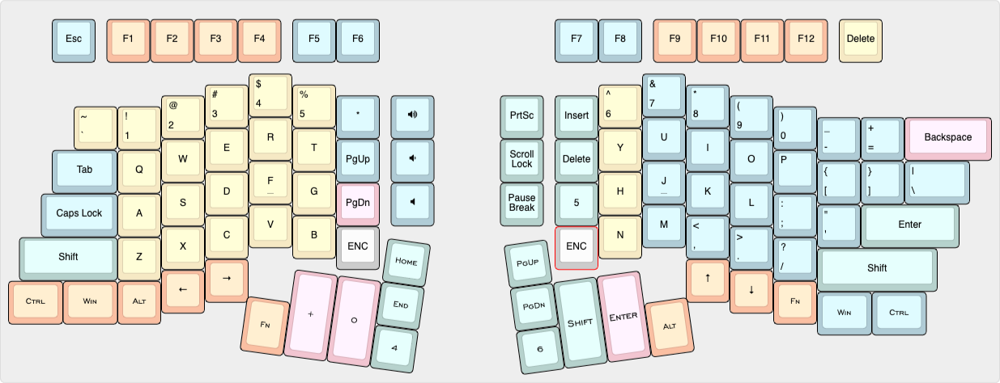

# ErgoDonk v0.9
ErgoDox variant that uses standard 100% SA keycaps, Blackpill MCU and an FDM printed case. 

[keyboard layout editor](http://www.keyboard-layout-editor.com/#/gists/ac776db3b0deef94de51943c384cfdfc)

## Build Log
Experiments to date:
* Prototype initially built with Blackpill MCU. Works well.
* Refactored to use LED
* Refactored to use ProMicro
* Refactored to use Pico 2040
* Prototype sent out for production 7-26-2023

### Lessons learned from the ds simple prototype (todo)
* Fix the stabalizers. Two screw-in PCB stabalizers won't fit next to each other on the thumb cluster - try the plate mount stabs instead.
* Take a closer look at routing by the rotary encoders - may be a short
* The DS version is charged as two keyboards by JLCPCB - compare pricing for building as two seperate halves.
* The RH Trackball has 2 seperate pcbs. Top one sent out for prototype, bottom needs to be made.

